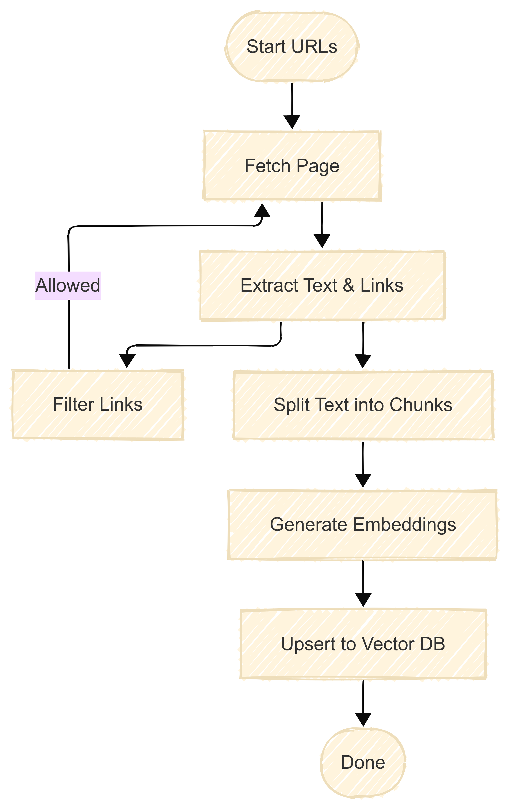
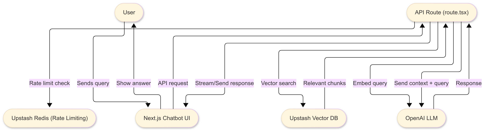

# iQuest

## Open source rag scholarship chatbot and project starter kit


**iQuest** is a project designed to make it easier to build your own rag bot or to give you a starting point for a more advanced bot
- 🕷️ Built-in crawler that scrapes the website you point it to, automatically making this data available for the AI
- ⚡ Fast answers using Upstash Vector and real-time data streaming
- 🛡️ Includes rate limiting to prevent API abuse
- 🎨 Modern dark theme UI with interactive elements

This chatbot is configured by default to crawl [Scholars4Dev](https://www.scholars4dev.com/), a site for international scholarships, but is totally domain agnostic. We've created this project so you can turn it into a chatbot with your very own data by simply modifying the `crawler.yaml` file.  

## Overview

1. [Stack](#stack)
2. [Quickstart](#quickstart)
   1. [Crawler](#crawler)
   2. [ChatBot](#chatbot)
3. [Conclusion](#conclusion)
4. [Shortcomings](#shortcomings)

## Stack

- Crawler: [scrapy](https://scrapy.org/)
- Chatbot App: [Next.js](https://nextjs.org/)
- Vector DB: [Upstash](https://upstash.com/)
- LLM Orchestration: [Langchain.js](https://js.langchain.com)
- Generative Model: [OpenAI](https://openai.com/), [gpt-3.5-turbo-1106](https://platform.openai.com/docs/models)
- Embedding Model: [OpenAI](https://openai.com/), [text-embedding-ada-002](https://platform.openai.com/docs/guides/embeddings)
- Text Streaming: [Vercel AI](https://vercel.com/ai)
- Rate Limiting: [Upstash](https://upstash.com/)

## Quickstart

For local development, we recommend forking this project and cloning the forked repository to your local machine

This project contains two primary components: the crawler and the chatbot. First, we'll take a look at how the crawler extracts information from any website you point it to. This data is automatically stored in an Upstash Vector database. If you already have a vector database available, the crawling stage can be skipped.

### Step 1: Crawler



The crawler is developed using Python, by [initializing a Scrapy project] and implementing a [custom spider]. The spider is equipped with [the `parse_page` function], invoked each time the spider visits a webpage. This callback function splits the text on the webpage into chunks, generates vector embeddings for each chunk, and upserts those vectors into your Upstash Vector Database. Each vector stored in our database includes the original text and website URL as metadata.

</br>

To run the crawler, follow these steps:

> [!TIP]
> If you have docker installed, you can skip the "Configure Environment Variables" and "Install Required Python Libraries" sections. Instead you can simply update the environment variables in [docker-compose.yml]and run `docker-compose up`. This will create a container running our crawler. Don't forget to configure the crawler as explained in the following sections!

<details>

<summary>Configure Environment Variables</summary>
Before we can run our crawler, we need to configure environment variables. They let us securely store sensitive information, such as the API keys we need to communicate with OpenAI or Upstash Vector.

If you don't already have an Upstash Vector Database, create one [here](https://console.upstash.com/vector) and set 1536 as the vector dimensions. We set 1536 here because that is the amount needed by the embedding model we will use. 


The following environment variables should be set:

```
# Upstash Vector credentials retrieved here: https://console.upstash.com/vector
UPSTASH_VECTOR_REST_URL=****
UPSTASH_VECTOR_REST_TOKEN=****

# OpenAI key retrieved here: https://platform.openai.com/api-keys
OPENAI_API_KEY=****
```

</details>

<details>
<summary>Install Required Python Libraries</summary>

To install the libraries, we suggest setting up a virtual Python environment. Before starting the installation, navigate to the `iquestcrawler` directory.

To setup a virtual environment, first install `virtualenv` package:

```bash
pip install virtualenv
```

Then, create a new virtual environment and activate it:

```bash
# create environment
python3 -m venv venv

# activate environment
source venv/bin/activate
```

Finally, use [the `requirements.txt`] to install the required libraries:

```bash
pip install -r requirements.txt
```

</details>


</br>

After setting these environment variables, we are almost ready to run the crawler. The subsequent step involves configuring the crawler itself, primarily accomplished through the `crawler.yaml` file located in the `iquestcrawler/utils` directory. Additionally, it is imperative to address a crucial setting within the `settings.py` file.

<details>
<summary>Configuring the crawler in `crawler.yaml`</summary>

The `crawler.yaml` file has two main sections: `crawler` and `index`. By default, it's configured for `scholars4dev.com`:

```yaml
crawler:
  start_urls:
    - https://www.scholars4dev.com/
  link_extractor:
    allow: '.*scholars4dev\\.com.*' # Regex pattern to allow URLs
    deny:
      - "#"
      - '\?'
index:
  openAI_embedding_model: text-embedding-ada-002
  text_splitter:
    chunk_size: 1000
    chunk_overlap: 100
```

In the `crawler` section, there are two subsections:

- `start_urls`: the entrypoints our crawler will start searching from
- `link_extractor`: a dictionary passed as arguments to [`scrapy.linkextractors.LinkExtractor`](https://docs.scrapy.org/en/latest/topics/link-extractors.html). Some important parameters are:
  - `allow`: Only extracts links matching the given regex(s)
  - `allow_domains`: (Not shown, but can be added) Only extract links matching the given domain(s)
  - `deny`: Deny links matching the given regex(s)

In the `index` section, there are two subsections:

- `openAI_embedding_model`: The embedding model to use
- `test_splitter`: a dictionary passed as arguments to [`langchain.text_splitter.RecursiveCharacterTextSplitter`](https://api.python.langchain.com/en/latest/text_splitter/langchain.text_splitter.RecursiveCharacterTextSplitter.html)

</details>

<details>
<summary>Configuring crawl depth via `settings.py`</summary>

`settings.py` file has an important setting called `DEPTH_LIMIT` which determines how many consecutive links our spider can crawl. A high value lets our crawler visit the deepest corners of a website, taking longer to finish with possibly diminishing returns. A low value could end the crawl before extracting relevant information.

If pages are skipped due to the `DEPTH_LIMIT`, Scrapy logs those skipped URLs for us. Because this usually causes a lot of logs, we've disabled this option in our project. If you'd like to keep it enabled, remove  [the `"scrapy.spidermiddlewares.depth"` from the `disable_loggers` in `iquestcrawler/spider/configurable.py` file]

</details>

</br>

That's it! 🎉 We've configured our crawler and are ready to run it using the following command:

```
scrapy crawl configurable --logfile iquestcrawl.log
```

Note that running this might take time. You can monitor the progress by looking at the log file `iquestcrawl.log` or the metrics of your Upstash Vector Database dashboard as shown below.


> [!TIP]
> If you want to do a dry run (without creating embeddings or a vector database), simply comment out [the line where we pass the `callback` parameter to the `Rule` object in `ConfigurableSpider`]

### Step 2: Chatbot

In this section, we'll explore how to chat with the data we've just crawled and stored in our vector database. Here's an overview of what this will look like architecturally:



Before we can run the chatbot locally, we need to set the environment variables as shown in the [`.env.local.example`]file. Rename this file and remove the `.example` ending, leaving us with `.env.local`. 

Your `.env.local` file should look like this:
```
# Redis tokens retrieved here: https://console.upstash.com/
UPSTASH_REDIS_REST_URL=
UPSTASH_REDIS_REST_TOKEN=

# Vector database tokens retrieved here: https://console.upstash.com/vector
UPSTASH_VECTOR_REST_URL=
UPSTASH_VECTOR_REST_TOKEN=

# OpenAI key retrieved here: https://platform.openai.com/api-keys
OPENAI_API_KEY=
```

The first four variables are provided by Upstash, you can visit the commented links for the place to retrieve these tokens. You can find the vector database tokens here:

The `UPSTASH_REDIS_REST_URL` and `UPSTASH_REDIS_REST_TOKEN` are needed for rate-limiting based on IP address. In order to get these secrets, go to Upstash dashboard and create a Redis database.

Finally, set the `OPENAI_API_KEY` environment variable you can get [here](https://platform.openai.com/api-keys) which allows us to vectorize user queries and generate responses.

That's the setup done! 🎉 We've configured our crawler, set up all neccessary environment variables are after running `npm install` to install all local packages needed to run the app, we can start our chatbot using the command:

```bash
npm run dev
```

Visit `http://localhost:3000` to see your chatbot live in action!

### Step 3: Optional tweaking

You can use this chatbot in two different modes:

- Streaming Mode: model responses are streamed to the web application in real-time as the model generates them. Interaction with the app is more fluid.
- Non-Streaming Mode: Model responses are shown to the user once entirely generated. In this mode, iQuest can explicitly provide the URLs of the web pages it uses as context.

<details>
<summary>Changing streaming mode</summary>

To turn streaming on/off, navigate to `src/app/route/guru` and open the `route.tsx` file. Setting [`returnIntermediateSteps`] to `true` disables streaming, setting it to `false` enables streaming.

</details>

To customize the chatbot further, you can update the `AGENT_SYSTEM_TEMPLATE in your route.tsx file` to better match your specific use case.

</br>

##

Author: [`@iBz-04`](https://github.com/iBz-04)
